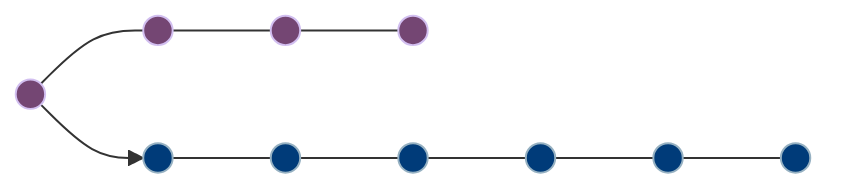
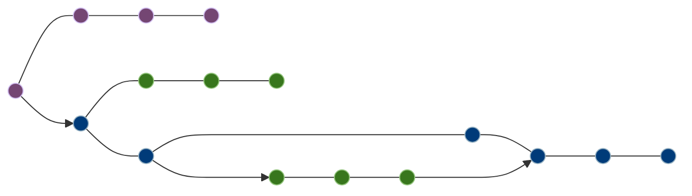
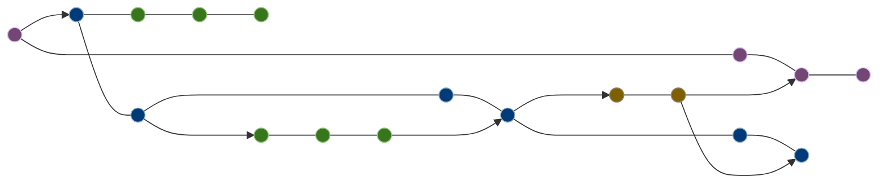
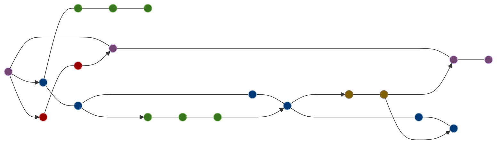
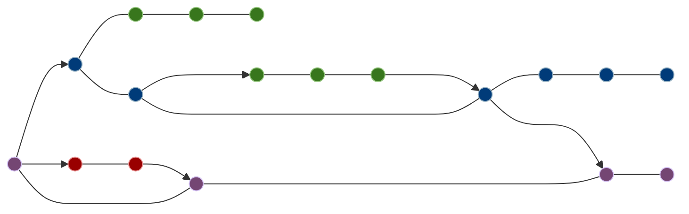
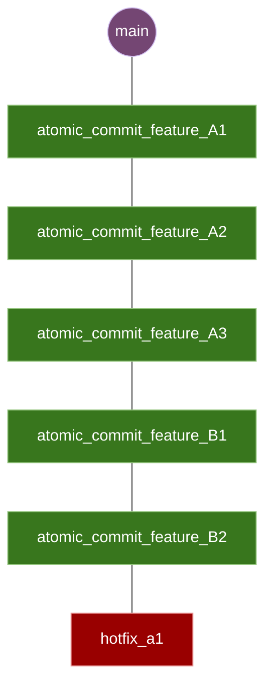
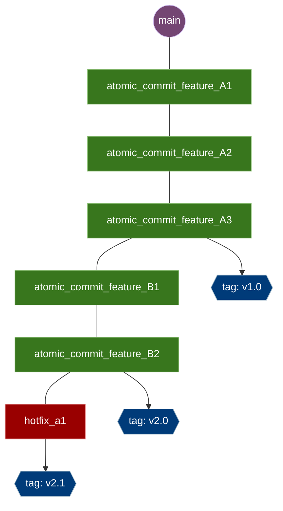

# git-workflow

Nesse tópico serão abordadas algumas estratégias e modelos para workflows utilizando git. Além das definições padrões, serão exemplificados adaptações para algumas situações, uma vez que modelos de workflow podem ser adaptados para se enquadrar de acordo com as necessidades dos projetos / empresas.

Sumário:

1. [Gitflow](#gitflow)
2. [Variação do Gitflow](#variação-do-gitflow)
3. [Trunk-based development](#trunk-based-development)

## Gitflow

Gitflow é um modelo de branching que utiliza-se de `feature branches` e múltiplas `primary branches`. Nesse modelo, é comum termos uma grande quantidade de branches ativas e commits maiores.

Neste modelo, os desenvolvedores criam uma `feature branch` e postergam o `merge` com a branch principal até que a feature esteja pronta.

As feature branches costumam existir por muito tempo até que ocorra o merge com a branch principal, podendo criar a necessidade de `pair programming` para executar o merge, alto risco de divergência de código com a branch principal e conflitos em atualizacões.

### Como utilizar o Gitflow

Primeiramente, teremos duas branches:
- main: Branch principal que conterá o histórico de releases;
- develop: Branch que serve para integração com `feature branches`

Para criarmos uma `feature branch`, basta utilizar o comando a partir da develop
> git checkout -b < nome da branch >

 Ao utilizar `feature branches`, é possível que o histórico de commits fique da seguinte forma:

Uma vez que a develop tenha as features desejadas para se criar uma versão, cría-se uma branch de `release`, onde os commits que devem entrar nessa branch devem ser apenas para correções de bugs.

Por fim, temos as branchs de `hotfix`. Essa branch é utilizada para correções rápidas e não funciona como uma `release`, pois sua branch origem é a `main`. Após a sua criação, executa-se a correção e em seguida, a correção deve ir tanto para a `main` quanto para a `develop`.

No geral, o `Gitflow` é uma boa opção para softwares baseados em `releases`. Outro ponto positivo é o canal dedicado para hotfix de bugs em produção.

Um breve resumo, o para se utilizar o `Gitflow`:

1. A branch `develop` é criada a partir da `main`
2. A branch `release` é criada a partir da `develop`
3. `Feature branches` são criadas a partir da `develop`
4. Quando uma `feature` é finalizada, deve-se fazer o merge na `develop`
5. Quando uma `release` é finalizada, deve-se fazer o merge na `develop` e na `main`
6. Se um bug for detectado na `main`, deve-se criar um `hotfix` a partir da `main` 
7. Uma vez que finalizado o hotfix, deve-se fazer o merge na `main` e `develop`.

Utilizar o `Gitflow` possui suas desvantagens. Por mais que priorize releases, as `feature branches` podem se tornar um problema durante o desenvolvimento.

Digamos que no software a ser desenvolvido, entre a prioridade de duas features que são de tamanhos grandes o suficiente para possuir mais de um mês de desenvolvimento.
As features serão desenvolvidas por times em paralelo e será quebrada em tarefas menores que serão dividos entre os times de desenvolvimento.

O time de QA poderá testar desde as tarefas menores, porém terão de fazer um teste de integração assim que houver o merge de uma das features na `develop`. O `pull request` para a `develop` será **gigantesco** dependendo do tamanhos da feature, o que trás duas possibilidades:

- Não haverá revisão dos desenvolvedores pois os códigos já foram revisitados em `pull requests menores`
- Poderá existir uma revisão uma vez que diversos `pull requests` para a `feature branch` possam conflitar entre si. É preciso ter a garantia de que todos os códigos estão na `feature branch` e funcionando corretamente.
 
Além disso, provavelmente uma feature será finalizada antes da outra e existirá a chance delas conflitarem. Em caso de conflito, qual será a garantia de que todas as features estarão funcionando corretamente após a atualização da `feature branch`? Os QAs deverão executar uma **segunda regressão**?

## Variação do Gitflow

Pelos problemas apresentados no `Gitflow`, foram criados outros workflows como o `Trunk-based development`. Mas essa forma de desenvolvimento **necessita** de ter processos bem estruturados, tarefas bem definidas e uma cultura de integração continua muito bem aplicada.

Para não existir uma mudança radical na cultura do time, essa adataptação do gitflow foi pensada baseando-se na **minha experiência no desenvolvimento em diversos projetos**. Está longe de ser considerado um workflow ideal, mas pode ser que ajude a sanar algumas dores ou problemas do momento, que tem como principal objetivo:

> Criar uma migração não tão radical no workflow e na cultura e processos de desenvolvimento, passando a trazer a obrigação de algumas boas práticas.

Os maiores problemas que ocorrem durante o `Gitflow` são com os merges das `Feature branches` e a geração de `releases` e seus `bugfixes`. E se não existisse uma `Feature branch` e para toda pequena tarefa fosse feito merge direto na `develop`? E se não existisse uma branch **release**?

Teríamos uma evolução gradual do projeto, onde cada `pull request` seria avaliado e testado isoladamente. Se um `pull request` for atômico a ponto de não poder ser testado por um QA, ele provavelmente será validado com a evolução da feature, uma vez que esse workflow não excluiria testes de integração feitos por QA.

Para seguir esse workflow, recomendo **fortemente** a utilização dos `pull request strategies` [squash](/git/pull-request-strategy.md#git-squash) ou [rebase](/git/pull-request-strategy.md#git-rebase). A utilização da estratégia [merge](/git/pull-request-strategy.md#git-merge) acarretará em grande complexidade para possíveis rollbacks em `releases` ou `hotfix` / `bugfix` que necessitem da observação do histórico de commits da branch `develop`, na qual está recebendo constantemente pull requests de tarefas atômicas.

Outra recomendação é utilizar [commit-patterns](/git/commit-pattern.md)

Seguiremos com as seguintes regras para poder executar a `variação do Gitflow workflow`:

- Durante os `pull requests`, deverá ser utilizado `rebase` ou `squash`
- **É extritamente necessário que o histórico de commits esteja organizado**  para que se mitigue a complexidade de `rollbacks` e `hotfixes`.

- **É extritamente necessário que as branches que contenham um pedaço atômico da feature estejam `atualizadas` com a `develop`** antes da abertura do `pull request` para evitar conflitos ao se fazer o merge com a `develop` e desorganizar o histórico de commits

- **É extritamente necessário que exista testes unitários**, validando o que se foi desenvolvido dentro de um determinado pull request.

- As `releases` existirão a partir da criação de `git tags` provindas de um determinado commit na `develop`. A branch `main` será atualizada até esse commit, resultando em um deploy.

Teremos então, o seguinte histórico de commits:

Mas essa abordagem também não resolve um problema que também ocorre no `Gitflow`, mas geralmente é isolado a partir de uma `feature branch`: 

> E se estiver sendo desenvolvido em paralelo uma feature que não pode ser versionada?

As possíveis soluções para esse problema podem ser:

- Utilização de `feature flags` para ativação e desativação de features.
- Impossibilitar o acesso do usuário a feature.
> Exemplo: Em um website, existe uma página sendo construída, porém não existe navegação para tal.
- Criação de uma `feature branch`. Para toda regra, há uma exceção, porém temos ciência dos problemas que a criação de uma `feature branch` pode ocasionar.

Observando o workflow, parece que estamos adicionando um passo a mais para a criação de uma tag de `release`. Por que então não apagar a `develop` e executar tudo direto na `main`?

Dessa forma, não existiria mais `hotfix`, seriam apenas `bugfix` que entrariam numa próxima tag de `release` e simplificaria muito o processo com a esteira de deploy.

Porém essa abordagem é seguida de mais algumas exigências que veremos a seguir.

## Trunk-based development

Para que esse workflow seja executado, existe a necessidade de que boas práticas sejam aplicadas:

- O desenvolvimento de atividades e `pull requests` devem ser atômicos;
- A utilização de `feature flags` para poder não travar a esteira de desenvolvimento e não criar `feature branches`;
- Criação de testes automatizados. Sempre que um `pull request` for aberto, deverá ser validado se nenhum teste quebrou, para que assim garanta que o `pull request` aberto não quebre o que já foi desenvolvido, gerando bugs
- Cultura de code review, executando o projeto e validando os pontos da tarefa e os testes criados para garantir seu funcionamento;
- Deletar branches que já foram mergeadas;
- Processos bem definidos para evitar blocks;
- Builds rápidas para execuções imediatas, onde o tempo de build e de execução de testes automatizados devem ser otimizados.

Recomendo fortemente a utilização de apenas [rebase](/git/pull-request-strategy.md#git-rebase) para `pull requests` e `atualizações de branch`. Assim será possível manter o histórico de commits organizado, podendo servir até mesmo como documentação caso utilize-se [commit patterns](/git/commit-pattern.md)

Teremos então, o seguinte histórico de commits:

Em um mundo ideal com a utilização de deploys contínuos, cada `rebase` na branch `main` criaria um artefato em produção.

Caso exista algum receio, ainda é possível criar versões a partir de `git tags` em determinados commits

