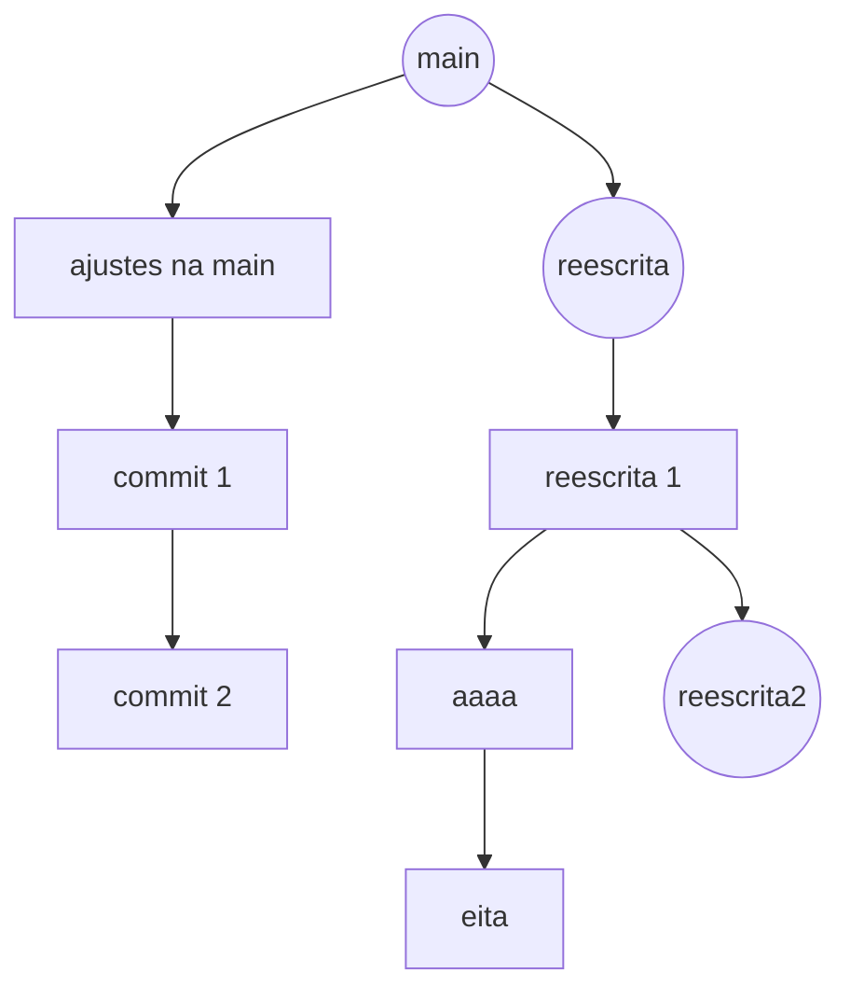
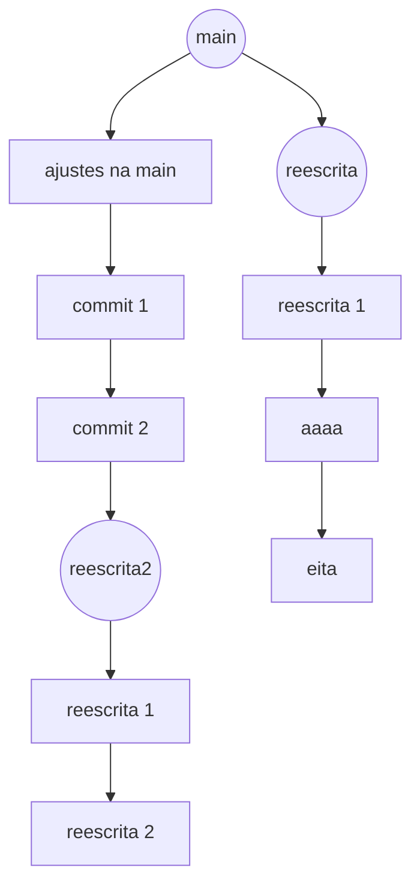

# pull-request-strategy

Esse documento tem como objetivo apresentar uma solução para a estratégia o versionamento durante o desenvolvimento de software.

Utilizaremos `git` como sistema de controle de versão e a plataforma `github`para os exemplos. 

## Histórico de commits

Para utilizar git, existem diversos comandos para poder se versionar. Cada comando altera o `histórico de commits` de uma forma diferente. Para esse exemplo, iremos focar e exemplificar como ficaria o `histórico de commits` nos comandos:

- [merge](#git-merge);
- [squash](#git-squash);
- [rebase](#git-rebase);

### git merge

Seguindo o exemplo:

Existiram alterações na branch `main` que crairam um conflito com a branch `change-readme`.

Para poder continuar com o `Pull request`, será necessário resolver o conflito na branch `change-readme` para então fazer o merge com a main.

Uma das formas de resolver esse problema, é atualizar a branch `main` e executar o comando merge na branch `change-readme`
> git merge main

Ao finalizar esse processo, o `histórico de commits` ficará da seguinte forma:

e por fim, ao executar o merge do `Pull request`, teremos:

**Prós de se utilizar essa estratégia**
- Necessita de apenas uma revisão de código quando tiver conflito.
- Simples de executar.
- Só existirá perda de código se durante a resolução do conflito algo for apagado.

**Contras de se utilizar essa estratégia**
- O comando merge cria novos commits ao ser executado. No exemplo:
    > Merge branch 'main' into change-readme

    Por conta disso, ocorre uma poluição visual no `histórico de commits`
- A longo prazo, torna-se inviável olhar para commits mais antigos pela complexiadade de observar a origem, o histórico de modificações e em que momento cada branch foi atualizada.
- Existe uma alta complexidade para se fazer rollback, pois voltar para uma determinada hash de um commit não garante que todas as modificações desejadas estejam no determinado ponto.

- Em um projeto onde muitas pessoas pessoas atualizam, o `histórico de commits` pode ficar da seguinte forma

> Antes de fazer o merge da primeira branch criada a partir da main

> Após executar o merge de todas as branchs abertas

 
### git squash

Seguindo o exemplo anterior, digamos que cria-se uma nova branch, mas ao invés de utilizar `merge` para concluir o `Pull request`, seja utilizado `squash`

Durante o processo de `Pull resquest` teríamos o `histórico de commits` da seguinte forma:

A branch `v2` terá conflito ao tentar concluir o `Pull request`. Ainda utilizaremos a estratégia de `merge` para atualizar a branch.

Ao executar o `Pull request`, ao invés de utilizar `merge`, será feito `squash` da branch na main.

E por fim teremos o `histórico de commits` da seguinte forma: 

O processo de fazer `squash` durante o `Pull request` pegará **todos** os commits da branch e adicionará na `main` um novo commit com todas as modificações que estavam no `Pull request`.

**Prós de se utilizar essa estratégia**
- Necessita de apenas uma revisão de código quando tiver conflito. (mesma coisa que `merge`)
- Simples de executar.
- Só existirá perda de código se durante a resolução do conflito algo for apagado.
- Ao fazer rollback, existe a garantia de que a feature inteira será retirada, uma vez que os commits da `main` estão unificados em um bloco só.
- Um `histórico de commits` mais limpo se comparada com `merge`

**Contras de se utilizar essa estratégia**
- Na branch principal, teremos apenas um commit contendo uma feature como um todo, com muito código ao invés de ter vários commits menores dentro de seus determinados contextos.
- Existe uma alta complexiadade para poder dar rollback ou rever código do histórico de commits, uma vez que os commits na `main` tendem a ficar muito maiores.

### git rebase

Um terceiro comando para versionar, é o comando `rebase`. Podemos usar esse comando para, além de finalizar um `Pull request`, para atualizar uma branch feature em relação a `main`. É possível também remover commits desnecessários (possibilidade de utilizar `squash` durante o `rebase`)

O `rebase` reescreve o `histórico de commits`, o que o torna uma estratégia que depende de uma maturidade maior do time que o está utilizando. Seguindo o exemplo:

Observa-se na imagem acima que criamos uma branch a partir da maine alteramos o código adicionando um novo commit. Porém, houve alguma alteração na main, portanto precisamos atualizar a branch. Faremos isso utilizando o comando `rebase` ao invéz do `merge`:

Nota-se que deu conflito na branch `3.0`. Resolve-se o conflito da mesma maneira que no `merge`. Porém aqui existe uma diferença. Em vez de criar uma novo commit, o `rebase` cria uma nova hash (como na imagem a cima, saímos do que seria a branch `3.0`e fomos para hash `1e3e92d...`) pois neste momento começa a **reescrita do histórico de commits**. Caso não deseje continuar, é possível cancelar todas as modificações com o comando:

> git rebase --abort

ou se desejar continuar:

> git rebase --continue

O que ocorre a partir de agora é que para cada commit subsequente da sua branch, iremos atualizar com o código que está na main.

Uma vez que dê conflito, os próximos commits a serem verificados serão comparados com o commit da resolução do conflito. Nesse exemplo, manteremos apenas o código do `Incoming Change`

Podemos observar que o `rebase` continuou a partir do código do primeiro conflito, pois **reescrevemos** o commit `start 3.0` para arrumar os conflitos com a main. Reescreveremos agora os commits `parte 1` e `parte 2` resolvendo seus conflitos. Por fim, por se tratar de uma **reescrita**, será necessário utilizar o comando

> --force

ao executar o push para atualizar a branch.
Ao finalizar a atualização da branch, teremos uma `Árvore de commits` da seguinte forma:

Observa-se que todos os commits da branch `3.0` foram reescritos **após a última atualização da `main`**

Ao se executar um `rebase` no `Pull request` da branch `3.0` para a `main`, teremos:

Em suma, teremos todos os commits da branch `3.0` ordenados agora na `main` e a ordem do histórico será determinada pela entrada de rebases de features para a main.

**Prós de se utilizar essa estratégia**
- Histórico de commits limpo e organizado;
- Possibilidade de dar rollbacks pontuais em commits;
- Facilidade de tagueamento de releases;
- Facilidade de leitura dos commits para revisitar tarefas ou bugs;

**Contras de se utilizar essa estratégia**

- Durante a reescrita do `histórico de commits`, é necessário que tenha-se a absoluta certeza de que todas as branchs estejam **atualizadas** com suas respectivas branchs **originárias**. É possível executar o rebase a partir de branchs diferentes, reescrevendo e gerando commits duplicados ou até mesmo apagando commits.

Temos 3 branchs nessa imagem: `reescrita`, `reescrita2` e `main`
A branch `reescrita` veio a partir da `main`.
A branch `reescrita2` veio a partir de `reescrita`

teremos o seguinte grafo, onde cada `branch` é representado por **circunferências**, e commits daquela branch por **retângulos**:

se por um acaso desejarmos enviar a branch de `reescrita 2` direto para a main, serão criadas novas hash, criando o seguinte histórico / grafo:

Aqui já é possível notar um problema: Existem dois commits duplicados de `reescrita 1`.
se finalizarmos o `pull request` de `reescrita 2` na `main`, teremos:

Ao tentar atualizar a branch `reescrita`, acontecerá o seguinte problema: haverão conflitos por códigos **duplicados** com hashs diferentes.

- Algumas `merge tools` utilizam o comando
> --skip

como padrão para resolver conflitos. Isso pode ocasionar em perda de código.
